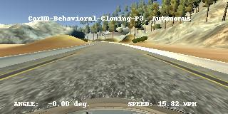

# Behavioral Cloning Project

[](http://www.udacity.com/drive)

## Overview
This repository contains result files for the Behavioral Cloning Project prepared by YIvanov.



For mode details please take a look [writeup file](./writeup_yivanov.md)


## Environment information

| SW | version |
|------|------|
|Microsoft Windows| 10 |
|Python | 3.8 |
|TensorFlow | 2.4.1 |
|NVIDIA Driver Version | 461.40 |      
|CUDA Version | 11.2 |
|cudnn|8.1.0.77|

## Run pretrained model
```python
python ./drive.py ./saved/model.0.0109.17.h5
```
