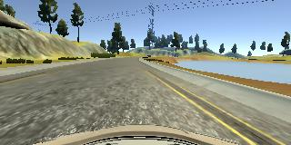
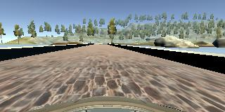
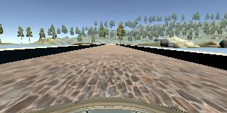
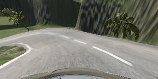
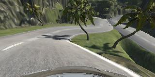

# **Behavioral Cloning**

# Writeup by YIvanov

---

**Behavioral Cloning Project**

The goals / steps of this project are the following:
* Use the simulator to collect data of good driving behavior
* Build, a convolution neural network in Keras that predicts steering angles from images
* Train and validate the model with a training and validation set
* Test that the model successfully drives around track one without leaving the road
* Summarize the results with a written report

[//]: # (Image References)

[image_model_arch]: ./images/nvidia_cnn_Dp0.30_kr0.0001_plt.png "Model architecture visualization"
[image_model_train]: ./images/nvidia_cnn_Dp0.30_kr0.0001_0.0111.png "Model train curves visualization"
[image_data_tr1f]: ./images/tr1_flip_input_image_preproc.png "Train data sample, track 1, flip"
[image_data_tr2f]: ./images/tr2_flip_input_image_preproc.png "Train data sample, track 2, flip"
[image_data_tr2s]: ./images/tr2_shadow_input_image_preproc.png "Train data sample, track 2, shadow"

## Rubric Points
Here I will consider the [rubric points](https://review.udacity.com/#!/rubrics/1968/view) individually and describe how I addressed each point in my implementation.  

---

### Files Submitted & Code Quality

#### 1. Submission includes all required files and can be used to run the simulator in autonomous mode

My project includes the following files:
* [model.py](./model.py) containing the script to create and train the model
* [drive.py](./drive.py) for driving the car in autonomous mode
* [model.0.0109.17.h5](./saved/model.0.0109.17.h5) containing a trained convolution neural network
* [writeup_yivanov.md](./writeup_yivanov.md) summarizing the results
* [track1.mp4](./video/track1.mp4) recorded video of 1st track autonomous driving
* [track2.mp4](./video/track2.mp4) recorded video of **2nd track** autonomous driving

#### 2. Submission includes functional code
Using the Udacity provided simulator and my drive.py file, the car can be driven autonomously around the track by executing:
```sh
python ./drive.py ./saved/model.0.0109.17.h5
```

#### 3. Submission code is usable and readable

The [model.py](./model.py) file contains the code for training and saving the convolution neural network and can be used by executing:
```sh
python ./model.py
```
The file shows the pipeline I used for training and validating the model, and it contains comments to explain how the code works.

### Model Architecture and Training Strategy

#### 1. An appropriate model architecture has been employed

My model consists of a convolution neural network with 5x5 and 3x3 filter sizes and numbers of features between 24 and 64, [model.py](./model.py) code:
```python
layers.append(  tf.keras.layers.Conv2D( filters=24, kernel_size=(5, 5), strides=( 2, 2), padding='valid', activation=activation )  )
layers.append(  tf.keras.layers.Conv2D( filters=36, kernel_size=(5, 5), strides=( 2, 2), padding='valid', activation=activation )  )
layers.append(  tf.keras.layers.Conv2D( filters=48, kernel_size=(5, 5), strides=( 2, 2), padding='valid', activation=activation )  )
layers.append(  tf.keras.layers.Conv2D( filters=64, kernel_size=(3, 3), strides=( 1, 1), padding='valid', activation=activation )  )
layers.append(  tf.keras.layers.Conv2D( filters=64, kernel_size=(3, 3), strides=( 1, 1), padding='valid', activation=activation )  )
```

The model has been used RELU activation function to introduce nonlinearity, code:
```python
activation = 'relu'
```
The data is normalized in the model using a Rescaling layer, code:
```python
layers.append(  tf.keras.layers.experimental.preprocessing.Rescaling(  scale=1./127.5, offset=-1.0  )                          )
```

#### 2. Attempts to reduce overfitting in the model

The model contains dropout layers equal to 0.3 and kernel regularizers l2 equal to 1e-4 in order to reduce overfitting, [model.py](./model.py) code:
```python
dropout = 0.3
kernel_regularizer = tf.keras.regularizers.l2( 1e-4 )
```

The model was trained and validated on different data sets to ensure that the model was not overfitting that can be observed on model training curve:

![Model train curves][image_model_train]

The model was tested by running it through the simulator and ensuring that the vehicle could stay on the track.

#### 3. Model parameter tuning

The model used an Adam optimizer, so the learning rate was not tuned manually, [model.py](./model.py) code:
```python
model.compile(  optimizer = tf.keras.optimizers.Adam( )
            , loss    = tf.keras.losses.MeanSquaredError( )
           )
```

#### 4. Appropriate training data

##### 1st track
I've used train data provided by Udacity. That contains all required use cases:

| central image                                         | steering     |
|-------------------------------------------------------|--------------|
| | -0.9426954   |
| | -0.771834    |
| | -0.002791043 |

Looks like, it contains all required use-cases for trainig on 1st track.

##### 2nd track

I've recorded several laps of second track with all cases like:
* central driving
* save from left
* save from right

| central image                                         | steering  |
|-------------------------------------------------------|-----------|
| | -0.0125   |
| | 0.98125   |
| | -0.928125 |

For details about how I created the training data, see the next section.

### Model Architecture and Training Strategy

#### 1. Solution Design Approach

The overall strategy for deriving a model architecture was to design a Convolutional Neural Network that will be able to predict a steering wheel angle by the input image.

My first step was to use a convolution neural network model similar to the Lenet5. I thought this model might be appropriate because, this model contains several convolutional layers and fully connected layers on top of it, also this model has been recommended as start point in project introduction.

I've used a 80/20 train validation split for my model:
```python
history = model.fit(   x = x
         , y = y
         , batch_size=1000
         , epochs = 20
         , validation_split = 0.2
         , shuffle = True
         , callbacks = [ callback_model_checkpoint ]
)
```

In order to gauge how well the model was working, I split my image and steering angle data into a training and validation set. I found that my first model had a low mean squared error on the training set but a high mean squared error on the validation set. This implied that the model was overfitting.

To combat the overfitting, I've introduced Dropout layers and kernel regularization, that recommended by [tensorflow documentation](https://www.tensorflow.org/tutorials/keras/overfit_and_underfit). Unfortunately this model doesn't provide enougth low losses on validation dataset.

Then I decide to switch on NVidia CNN architecture, that has been recommended as possible solution during project introduction

The final step was to run the simulator to see how well the car was driving around track one. There were a few spots where the vehicle fell off the track, because of shadows that cover the road. To improve the driving behavior in these cases, I applied additional random show data augmentation.

At the end of the process, the vehicle is able to drive autonomously around the track 1 and 2 without leaving the road.

#### 2. Final Model Architecture

The final model architecture, [model.py](./model.py) code:
```python
def get_model_nv( ) :

   dropout = 0.3
   kernel_regularizer = tf.keras.regularizers.l2( 1e-4 )
   activation = 'relu'
   padding = 'valid'

   layers = []

   layers.append(  tf.keras.layers.InputLayer( input_shape=( 66, 200, 3) )                                                            )
   layers.append(  tf.keras.layers.experimental.preprocessing.Rescaling(  scale=1./127.5, offset=-1.0  )                              )
   layers.append(  tf.keras.layers.Conv2D( filters=24, kernel_size=(5, 5), strides=( 2, 2), padding='valid', activation=activation )  )
   layers.append(  tf.keras.layers.Dropout( dropout )                                                                                 )
   layers.append(  tf.keras.layers.Conv2D( filters=36, kernel_size=(5, 5), strides=( 2, 2), padding='valid', activation=activation )  )
   layers.append(  tf.keras.layers.Dropout( dropout )                                                                                 )
   layers.append(  tf.keras.layers.Conv2D( filters=48, kernel_size=(5, 5), strides=( 2, 2), padding='valid', activation=activation )  )
   layers.append(  tf.keras.layers.Dropout( dropout )                                                                                 )
   layers.append(  tf.keras.layers.Conv2D( filters=64, kernel_size=(3, 3), strides=( 1, 1), padding='valid', activation=activation )  )
   layers.append(  tf.keras.layers.Dropout( dropout )                                                                                 )
   layers.append(  tf.keras.layers.Conv2D( filters=64, kernel_size=(3, 3), strides=( 1, 1), padding='valid', activation=activation )  )
   layers.append(  tf.keras.layers.Flatten( )                                                                                         )
   layers.append(  tf.keras.layers.Dropout( dropout )                                                                                 )
   layers.append(  tf.keras.layers.Dense(  100, activation=activation, kernel_regularizer = kernel_regularizer)                       )
   layers.append(  tf.keras.layers.Dropout( dropout )                                                                                 )
   layers.append(  tf.keras.layers.Dense(   50, activation=activation, kernel_regularizer = kernel_regularizer )                      )
   layers.append(  tf.keras.layers.Dropout( dropout )                                                                                 )
   layers.append(  tf.keras.layers.Dense(   10, activation=activation, kernel_regularizer = kernel_regularizer )                      )
   layers.append(  tf.keras.layers.Dropout( dropout )                                                                                 )
   layers.append(  tf.keras.layers.Dense( 1 )                                                                                         )

   model = tf.keras.Sequential( layers,
         name= 'nvidia_cnn_Dp{:.2f}_kr{:.4f}'.format(dropout, kernel_regularizer.l2)
      )

   model.compile(  optimizer = tf.keras.optimizers.Adam( )
               , loss    = tf.keras.losses.MeanSquaredError( )
              )    
   return model
```

Contains about 250K parameters:

| Entity             | Value                      |
|--------------------|----------------------------|
|Model               | nvidia_cnn_Dp0.30_kr0.0001 |
|Total params        | 252,219                    |
|Trainable params    | 252,219                    |
|Non-trainable params| 0                          |

And consisted of a convolution neural network with the following layers and layer sizes:

|Layer (type)                 | Output Shape           |   Param # |   
|-----------------------------|------------------------|-----------|
|rescaling (Rescaling)        |(None, 66, 200, 3) |       0      |   
|conv2d (Conv2D)              |(None, 31, 98, 24)|        1824  |    
|dropout (Dropout)            |(None, 31, 98, 24)|        0     |   
|conv2d_1 (Conv2D)            |(None, 14, 47, 36)|        21636 |   
|dropout_1 (Dropout)          |(None, 14, 47, 36)|        0     |   
|conv2d_2 (Conv2D)            |(None, 5, 22, 48) |        43248 |   
|dropout_2 (Dropout)          |(None, 5, 22, 48) |        0     |   
|conv2d_3 (Conv2D)            |(None, 3, 20, 64) |        27712 |   
|dropout_3 (Dropout)          |(None, 3, 20, 64) |        0     |   
|conv2d_4 (Conv2D)            |(None, 1, 18, 64) |        36928 |   
|flatten (Flatten)            |(None, 1152)      |        0     |   
|dropout_4 (Dropout)          |(None, 1152)      |        0     |   
|dense (Dense)                |(None, 100)       |        115300|   
|dropout_5 (Dropout)          |(None, 100)       |        0     |   
|dense_1 (Dense)              |(None, 50)        |        5050  |   
|dropout_6 (Dropout)          |(None, 50)        |        0     |   
|dense_2 (Dense)              |(None, 10)        |        510   |   
|dropout_7 (Dropout)          |(None, 10)        |        0     |   
|dense_3 (Dense)              |(None, 1)         |        11    |   


Here is a visualization of the architecture

![Model architecture][image_model_arch]

That build with *plot_model* keras API:
```python
model = get_model_nv()
tf.keras.utils.plot_model(
   model,
   to_file='output/' + model.name +  '_plt.png',
   show_shapes=True,
   show_dtype=False,
   show_layer_names=True,
   rankdir='TB',
   expand_nested=True,
   dpi=120
)
```

#### 3. Creation of the Training Set & Training Process

For 1st track, I've used data that provided by Udacity. Here is an example image from this dataset and possible augmentation:

![Train data sample, track 1, flip][image_data_tr1f]

Same as for a second track:

![Train data sample, track 2, flip][image_data_tr2f]

But additionally, 2nd track introduce a shadows these are not present on first track:

![Train data sample, track 2, shadow][image_data_tr2s]

This cause, that I've used randomized shadow image augmentation.

For both 1st and 2nd tracks, I've used side cameras with steering angle adjustment +0.21 for left and -0.21 for right camera images.
```python
data_list.append( {'steering':steering+0.21, 'file_name':left,  'flip':flip, 'dropshadow':shadow } )
data_list.append( {'steering':steering-0.21, 'file_name':rigth, 'flip':flip, 'dropshadow':shadow } )
```

After the collection process, I had 328152 number of data points. I then preprocessed this data by Rescaling layer:
```python
layers.append(  tf.keras.layers.experimental.preprocessing.Rescaling(  scale=1./127.5, offset=-1.0  )                              )
```


I finally randomly shuffled the data set and put 20% of the data into a validation set.

I used this training data for training the model. The validation set helped determine, if the model was over or under fitting. The ideal number of epochs was 20 as evidenced by training and validation losses curves:
![Model train curves][image_model_train]

I used an Adam optimizer so that manually training the learning rate wasn't necessary.
